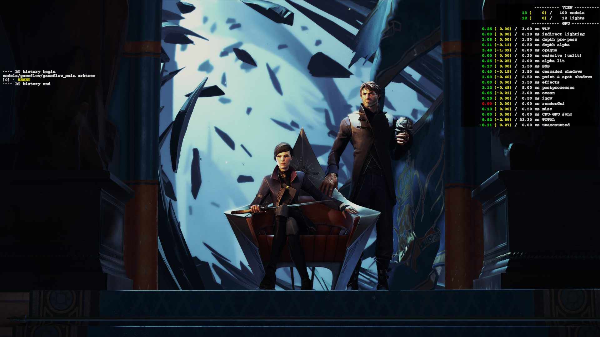
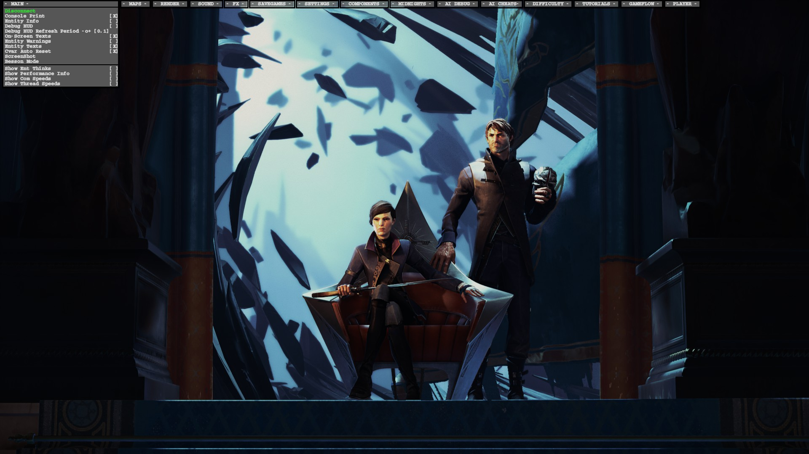
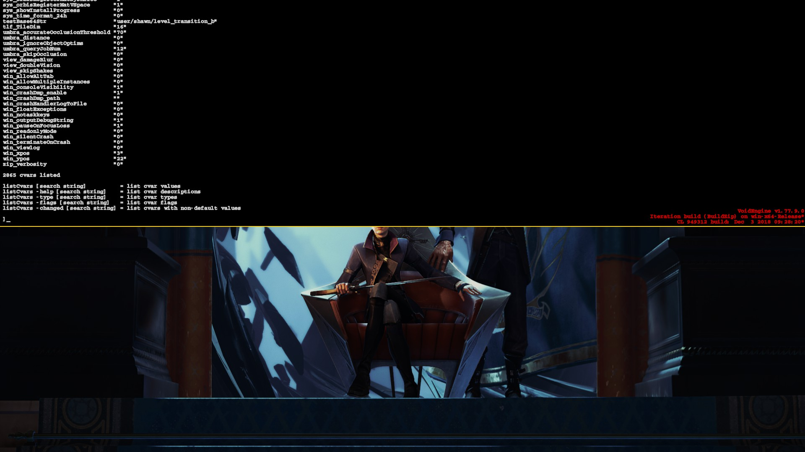

# Dishonored 2 Shims

## What?

For some reason the Steam version of Dishonored 2 includes some extra executables on Windows: https://steamdb.info/depot/531615/

The one named `Dishonored2_x64.exe` is over 30MB bigger compared to the exe Steam usually runs, `Dishonored2.exe`. This implies some extra functionality for developers/QA.

## The problem

`Dishonored2_x64.exe` links to some DLLs that are not easily to come by legally (e.g. some libraries from the PS4 SDK). However, the number of functions the game imports from those libraries is rather small, so I was wondering if we could make a shim for those so the non-retail exe actually runs.

Turns out we can!

## Getting to run

tl;dr:

- Build the Visual Studio solution (tested with VS 2022)
- Copy the built DLLs into the game directory (`steamapps/common/Dishonored 2`)
- Create a file called `steam_appid.txt` in the game directory, write the number `403640` inside
	- This is needed, because otherwise the game calls [SteamAPI_RestartAppIfNecessary](https://partner.steamgames.com/doc/api/steam_api#SteamAPI_RestartAppIfNecessary) during startup, which will end up launching the regular `Dishonored2.exe` (not what we want)
- Change the date on your computer to 12.09.2016. If you don't do this, a Havok license check will crash the game on load :S
- Start the game process via PowerShell: `.\Dishonored2_x64.exe +com_showLoadingScreen 0 +com_allowConsole`
	- `com_showLoadingScreen` will disable the intro movies for faster loading times
	- `com_allowConsole` allows you to press the ´ (forward tick) key to enable the debug HUD, then ^ (circumflex accent) key to show the console (assuming a German QWERTZ layout)

## What doesn't work

There's no UI, you just get dropped into the menu map but nothing else shows up. This is caused by returning 0 from `IggyPerfmonCreate()`. If we figure out how to make that call properly, the UI will work regularly.

The console works though :)

## Screenshots

Render stats:

Debug HUD:

Console:

# Havok

Havok licenses expire after 31.12.2018. If the system date is set after, the game will crash at startup.
